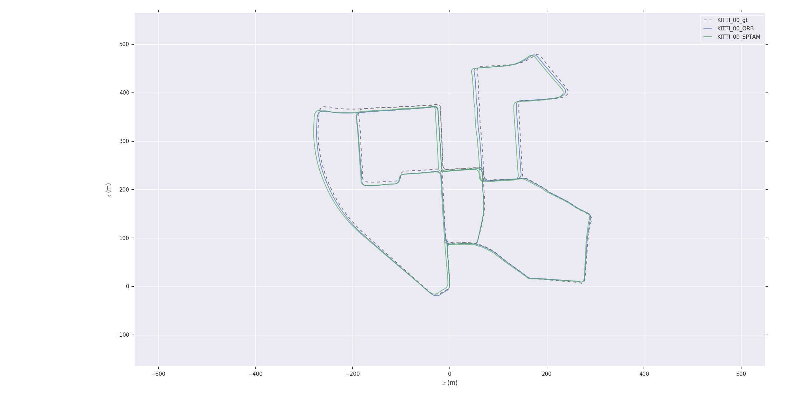
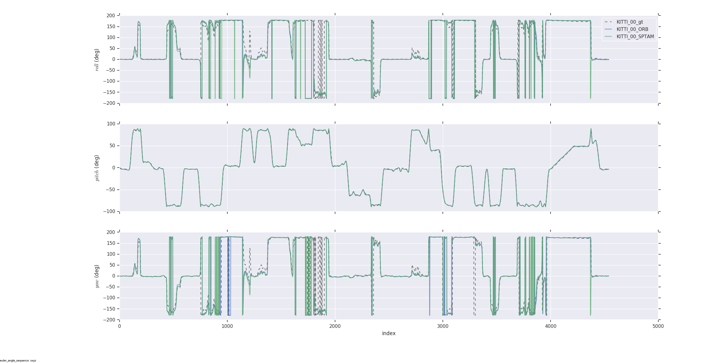
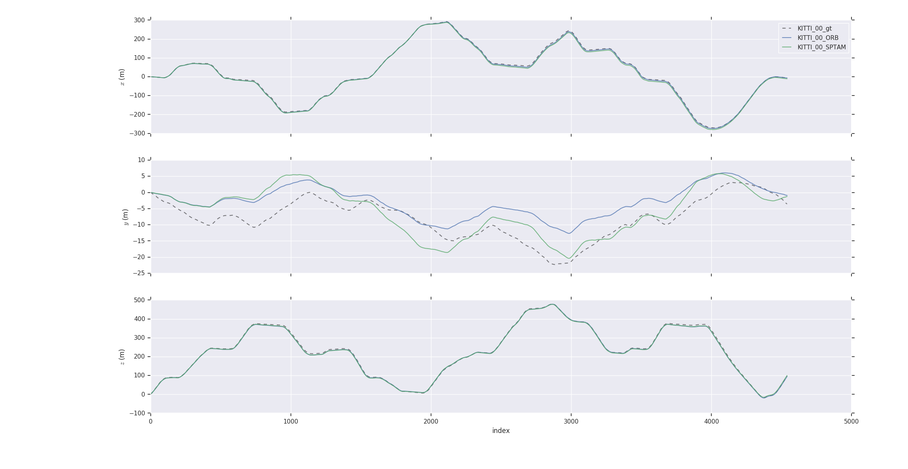
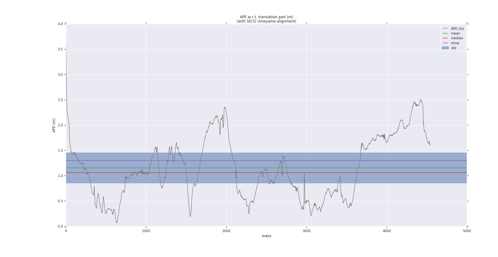
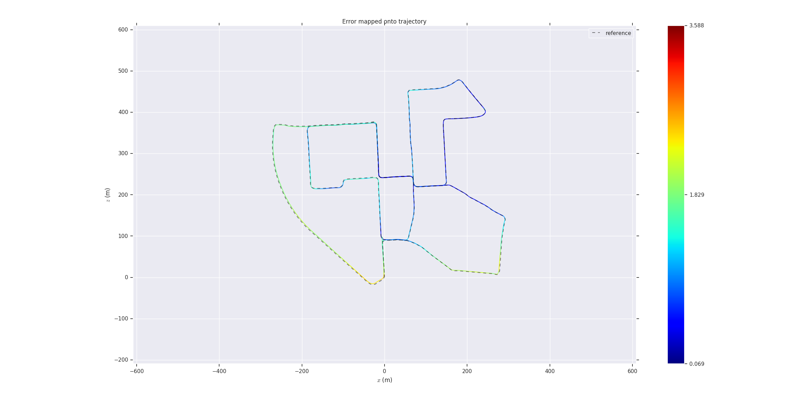
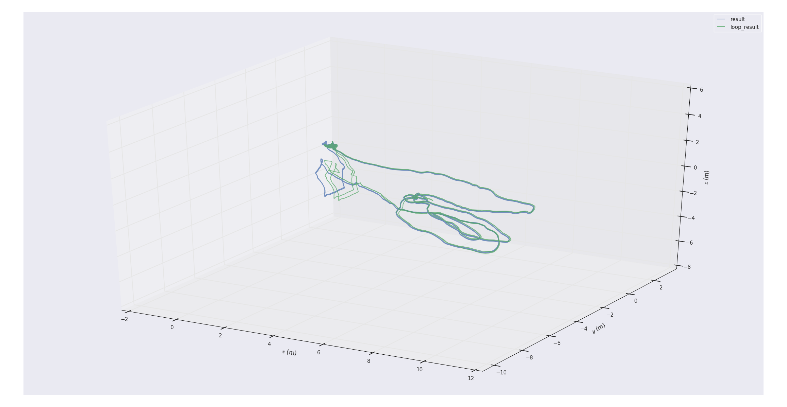
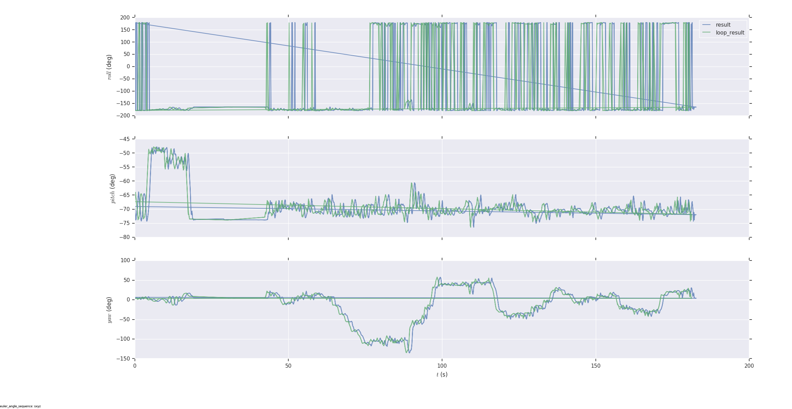
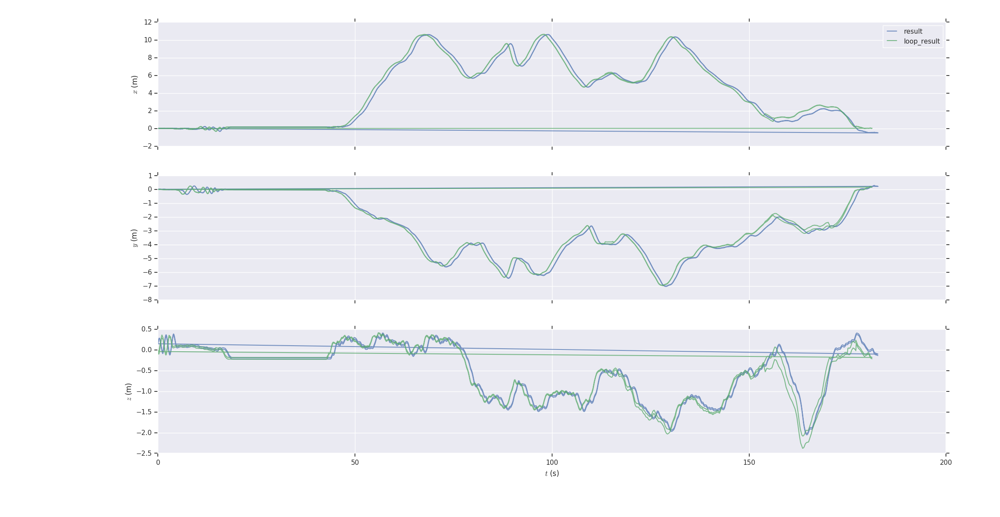
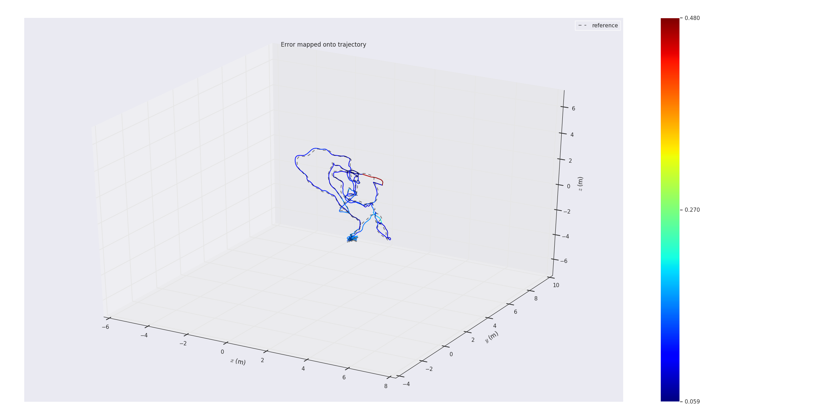
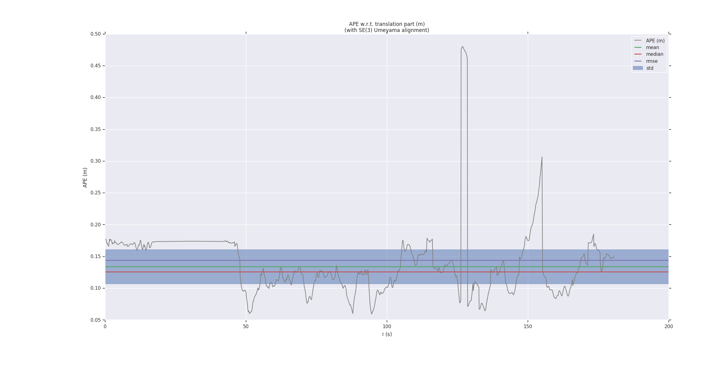

版权声明：** 本博客所有文章除特别声明外，均采用 [CC BY-NC-SA 4.0](https://creativecommons.org/licenses/by-nc-sa/4.0/) 许可协议。转载请注明出处

[toc]


# evo的介绍

基于python为了评估里程计以及SLAM系统，支持Linux/macOS/Windows/ROS.

evo库提供可执行文件以及库用于处理，评估以及对比各个SLAM算法的轨迹。

**支持轨迹文件**

- TUM轨迹文件

- KITTI位姿文件

- EuRoc MAV(.csv groundtruth and TUM trajectory file)

- ROS bag 包使用基于以下话题`geometry_msgs/PoseStamped`, `geometry_msgs/TransformStamped`, `geometry_msgs/PoseWithCovarianceStamped` or `nav_msgs/Odometry` topics

  [更详细的支持文件格式介绍参考](https://github.com/MichaelGrupp/evo/wiki/Formats)

  

## evo工具的优势

- 支持不同格式的通用工具
- 单目SLAM算法提供了关联、对齐以及比例调整等选项
- 用于输出、绘图、导出的灵活选项（plot图以及excel表）
- 一个强大的、可配置的CLI可以覆盖许多情况
- 自定义扩展的模块化核心和工具库
- 比其它基于python工具建立更快

## 安装 / 升级

具体步骤：

```c++
sudo apt install python-pip
pip install evo --upgrade --no-binary evo
```

可能出现的问题

```c++
Could not install packages due to an EnvironmentError: [Errno 13] Permission denied: '/usr/lib/python2.7/dist-packages/dateutil/relativedelta.pyc'

Consider using the `--user` option or check the permissions.
```

解决办法

```c++
pip install evo --upgrade --no-binary evo --user
```

测试

```c++
evo_traj euroc data.csv --plot
```

可能出现的问题

```c++
name: data
infos: 19753 poses, 91.747m path length, 98.760s duration
/usr/lib/python2.7/dist-packages/matplotlib/font_manager.py:273: UserWarning: Matplotlib is building the font cache using fc-list. This may take a moment.
warnings.warn('Matplotlib is building the font cache using fc-list. This may take a moment.')
[ERROR] Unhandled error in evo.main_traj
```

解决办法：

```c++
pip install numpy --upgrade --user 
```

## 命令行界面

**使用setup.py或pip安装后，可以从命令行全局调用以下可执行文件：**

即可以在任意终端下使用，而不必在evo工作目录下使用

- [x] 度量
- [x] evo_ape :绝对位姿误差
- [x] evo_rpe:相对位姿误差

**工具：**

- evo_traj:一种分析，绘制或者输出一个或者多条轨迹
- evo_res:从evo_ape或者evo_rpe方面比较一个或者多个结果文件
- evo_fig:（实验）用于重新打开序列化绘图工具（与serialize_plot一起保存）
- evo_config:用于全局设置和配置文件操作的工具

```
使用--help调用命令以查看选项，例如evo_ape--help。命令行参数的Tab completion在类UNIX系统上可用。
```

## Example

### 1、画多个轨迹

```c++
cd test/data
evo_traj kitti KITTI_00_ORB.txt KITTI_00_SPTAM.txt --ref=KITTI_00_gt.txt -p --plot_mode=xz
```







### 2、对轨迹进行度量

例如，在这里，我们使用evo_ape（KITTI_00_gt.txt是参考（地面真实值））计算ORB-SLAM和S-PTAM两个轨迹的绝对位姿误差，并将各个结果绘制并保存到evo_res的.zip文件中：

第一个轨迹：（ORB 双目）

```c++
mkdir results
evo_ape kitti KITTI_00_gt.txt KITTI_00_ORB.txt  -va --plot --plot_mode xz --save_results results/ORB.zip
```





### 3、从度量中处理多个结果

```
evo_res可用于比较度量中的多个结果文件，即：
打印信息和统计信息（默认）
绘制结果
将统计信息保存在表中
```

这儿，我们使用结果文件产生图和表格

```
evo_res results/*.zip -p --save_table results/table.csv
```

[reference:](https://michaelgrupp.github.io/evo/)

# 测试VINS_Mono在Euroc数据集上的表现

修改代码部分

visualization.cpp

```c++
 // write result to file 部分修改为以下代码
            // PATH 是保存输出文件的绝对路径，例如 /home/yourusername/vins_mono/
            // 要保证路径存在
 double turetime = header.stamp.toSec();
 ofstream foutC("/home/sunshine/catkin_final_VINS_Mono/result.csv",ios::app);
        foutC.setf(ios::fixed, ios::floatfield);
        foutC << turetime << " "
              << estimator.Ps[WINDOW_SIZE].x() << " "
              << estimator.Ps[WINDOW_SIZE].y() << " "
              << estimator.Ps[WINDOW_SIZE].z() << " " 
              << tmp_Q.x() << " "
              << tmp_Q.y() << " " 
              << tmp_Q.z() << " " 
              << tmp_Q.w() << endl;
        foutC.close();
```

修改pose_graph.cpp

```c++
if (SAVE_LOOP_PATH) 
    {
        // PATH 是保存输出文件的绝对路径，例如 /home/yourusername/vins_mono/
        // 要保证路径存在
        ofstream loop_path_file("/home/sunshine/catkin_final_VINS_Mono/loop_result.csv",ios::app);
        double turetime = cur_kf->time_stamp;
        loop_path_file.setf(ios::fixed, ios::floatfield);
        loop_path_file << turetime << " "
                       << P.x() << " " 
                       << P.y() << " "
                       << P.z() << " " 
                       << Q.x() << " " 
                       << Q.y() << " " 
                       << Q.z()<< " " 
                       << Q.w() << endl;
        loop_path_file.close();
```

使用catkin_make重新编译

```
roslaunch vins_estimator euroc.launch 
roslaunch vins_estimator vins_rviz.launch
rosbag play ~/MH_01_easy.bag 
```

在目标文件夹下生成*result.csv*以及*loop_result.csv*

通过在EUROC数据集中找到groudtrouth中找到data.csv

1、画出各个VINS_Mono运行的轨迹

```
evo_traj tum ./result.csv ./loop_result.csv -p --plot_mode=xyz
```






2、与真值（ground_trith）的比较






